# 地图美术对照

当前 0.10.0 新增地图与车辆见 [内容扩充说明](expansion.md)。以下保留历次镜头和材质调整记录。

## 0.9.4：提高赛车屏幕占比

标准相机距离从 62 m 缩至 42 m，中心附近物体的屏幕线性尺寸约增大 48%；保留 38° 俯角和 34° FOV。宽视野距离改为 62 m，高速最多拉远 3 m，速度方向预判最多 8 m。车辆模型、碰撞尺寸与赛道比例沿用原值，本次调整的是比赛取景。

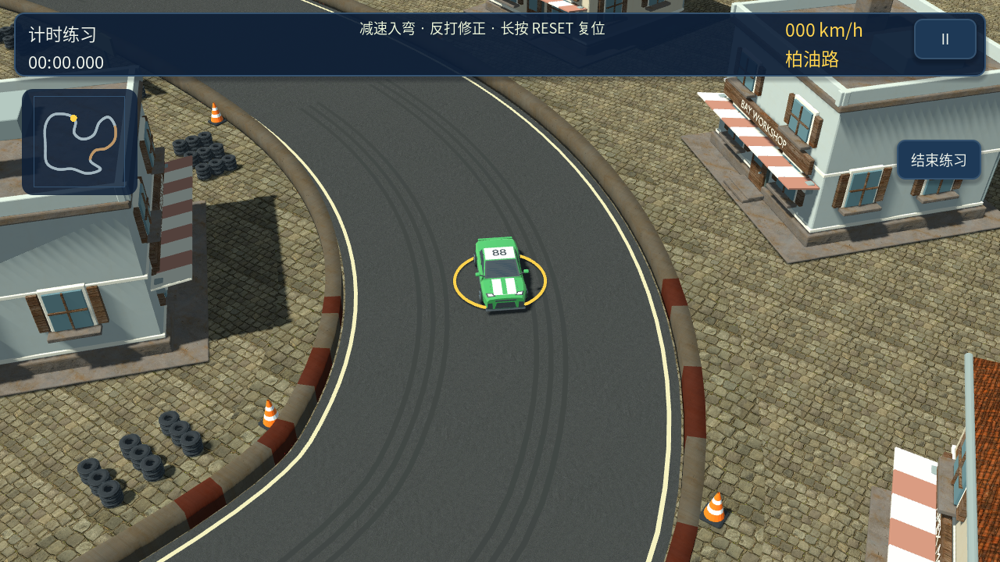
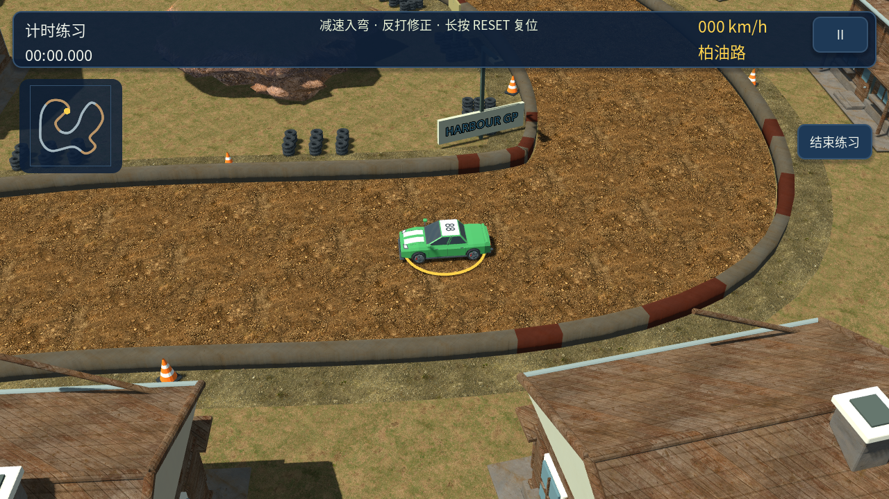

867 项镜头检查通过，包括三条路线正反方向、静止与高速、普通与宽视野，并在高速采样位置检查前方 18 m 路线点仍处于可用画面内。检查不覆盖全程建筑遮挡；截图经过实际渲染复核，尚未测试 Android 实机。

## 0.9.3：降低视角、整理材质

比赛相机从 49.3° 正交俯视改为 38° 俯角、34° FOV 的窄角透视。标准距离 62 m，宽视野 86 m；高速最多拉远 6 m，保持固定世界朝向和速度方向预判。重开比赛直接恢复对应距离，避免继承上一场的缩放。

海湾铺装缩小纹理单元，建筑灰泥改为低对比度风化材质，保留屋顶、窗框与投影的明暗层次。阴影距离和偏移随新镜头调整。路线、物理和生涯存档未改变。

以下为引擎实际截图，静止车辆、隐藏倒计时以便比较。旧镜头见[同位置调整前截图](screenshots/camera-before-0.9.3.png)，检查记录见[0.9.3 验证结果](validation/camera-0.9.3.json)。

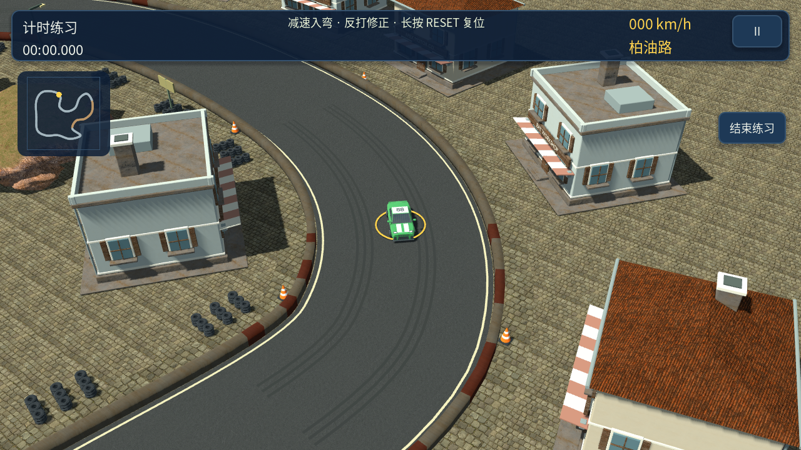
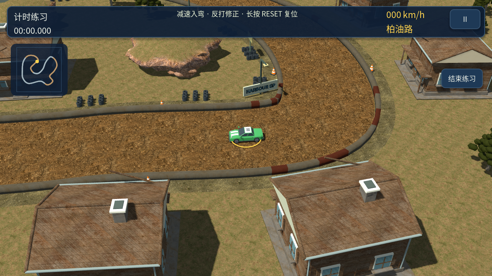
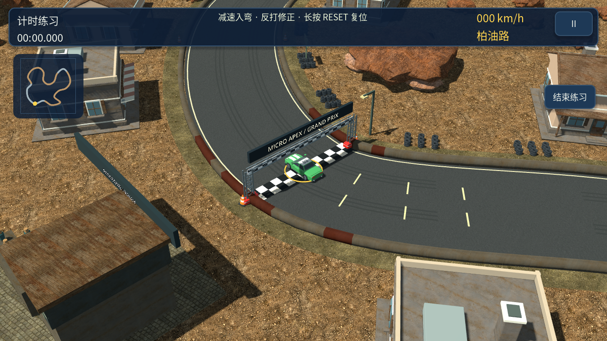

检查包括三条赛道六个固定位置的实际渲染，以及 579 项镜头检查（沿线采样、正反方向、静止/高速、普通/宽视野、重开恢复距离）。镜头检查验证赛车在可用画面范围内，不等于对全赛道遮挡和手机性能的验证。尚未在 Android 实机上复核。

建筑布置仍较重复、地形高差不足；降低相机解决的是构图和空间感，整体场景距离参考的丰富度仍有差距。

## 0.9.2：材质与模型重建记录

## 参考确认

2026-10-03 已联网核对用户指定的 **Mini Motor Racing 2 / RC Car（SelvasM）**，并查看其场景与实机截图。本次使用的是该续作的截图，不能将一代或 Mini Motor Racing X 的素材当成续作截图。

- [TapTap 游戏资料与截图](https://www.taptap.io/app/181276)
- [IGDB 游戏截图](https://www.igdb.com/games/mini-motor-racing-2)
- [村落、坡道、市场场景](https://images.igdb.com/igdb/image/upload/t_original/scfdkr.webp)
- [实机柏油弯道](https://images.igdb.com/igdb/image/upload/t_original/scfdkt.webp)
- [实机场景与地面质感](https://images.igdb.com/igdb/image/upload/t_original/scfdkv.webp)

参考图仅用于视觉分析，不随游戏或源码包分发。当前工程内的建筑、植被、标识均为原创生成内容。

## 差距与本轮修改

| 对照项 | 0.9.1 的问题 | 0.9.2 的处理 |
| --- | --- | --- |
| 路面 | 大块纯色、噪声模拟材质 | 引入有凹凸与遮蔽细节的 CC0 沥青、泥土、石铺地，保留独立轮胎磨损线 |
| 建筑 | 箱体拼装、轮廓单一 | 六套原创建筑：屋顶坡面、烟囱、窗框、百叶窗、门廊、落水管、店招和倒角 |
| 植被 | 锥体或球体冠层 | 分枝、细分叶簇与表面纹理；按实际镜头调整颜色 |
| 地形 | 平面与层叠圆台 | 雕刻岩块、沿路岩坡、草顶与岩壁按坡度混合 |
| 镜头与光照 | 赛车比例偏小、反射环境空白 | 标准镜头拉近，保留宽视野选项；补充天空反射和抗锯齿 |
| 场景标识 | 起跑门和设施缺少细节 | 原创起跑横幅、沿线赞助牌和双面赛事标识 |

路线路径和赛车物理沿用 0.9.1；本轮不重置纪录或生涯进度。材质质量和模型细节由实际游戏渲染复核，自动测试只证明功能与资源装载，不代表用户已认可美术标准。

## 实际游戏截图

以下由 `tests/capture_art.gd` 在游戏真实比赛镜头中生成。为方便比较，静止车辆并隐藏倒数数字；没有离线渲染或修图。

### 海湾街区

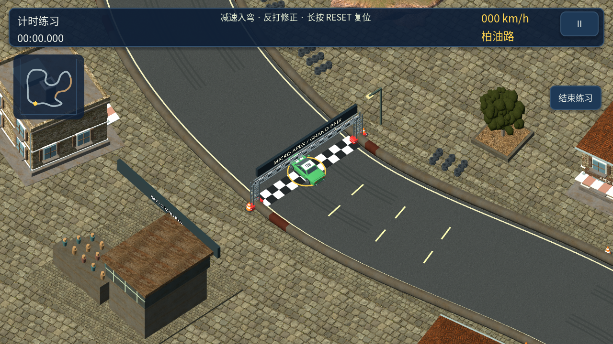
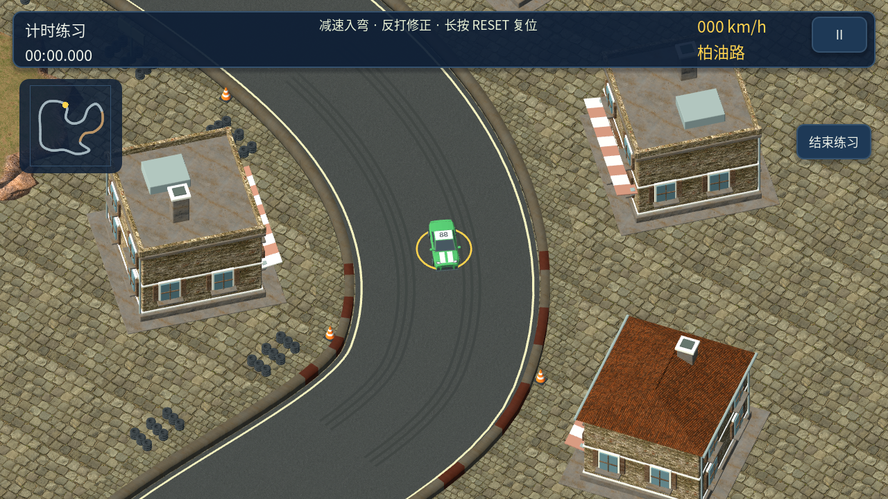

### 松林工坊

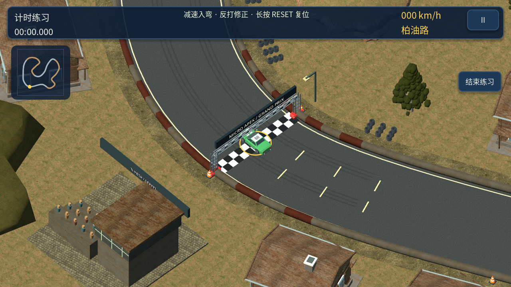
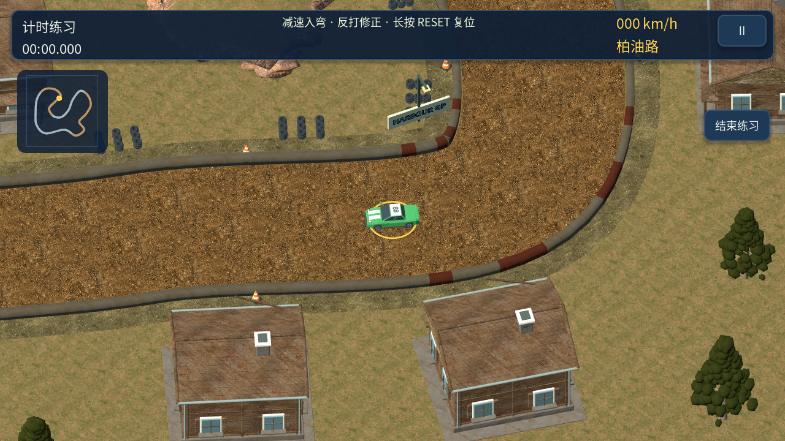

### 红岩矿镇

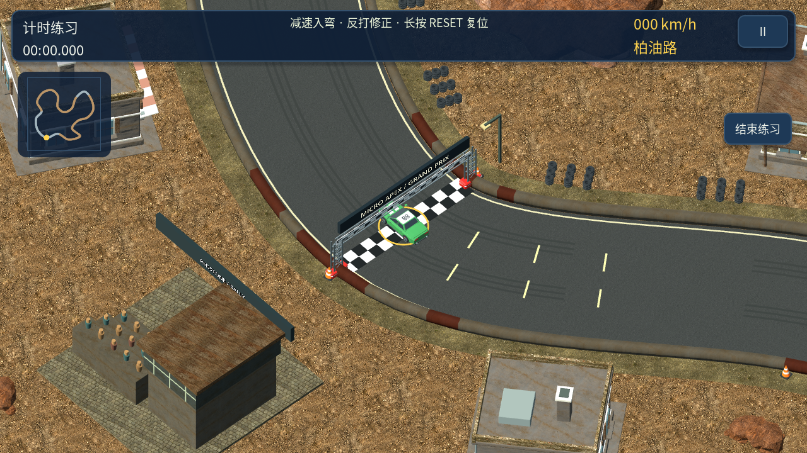
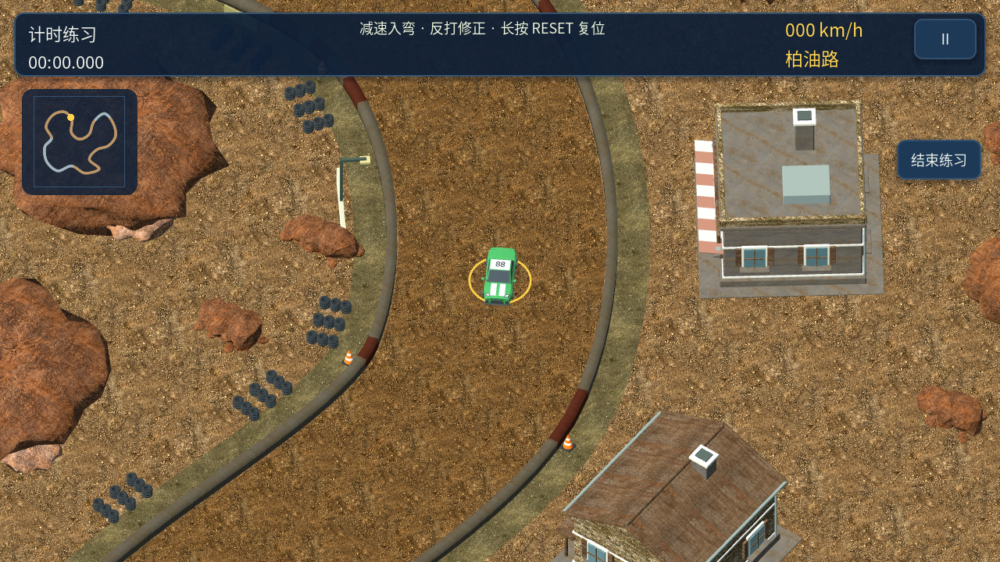

## 资产来源与重建

- 建筑、树木和岩石：`tools/build_district_art.py`，由 Blender 生成 9 个 GLB。
- 材质：[Poly Haven CC0](https://polyhaven.com/license)，共 11 套，1K 分辨率。每张纹理的来源、用途与 SHA256 见 `assets/textures/surfaces/manifest.json`。
- `tools/fetch_surface_assets.py` 优先使用已记录的 URL 和 SHA256 重建，避免悄然替换来源版本。
- 完整 CC0 法律文本与来源说明随包放在 `assets/legal/PolyHaven-CC0.txt`，游戏内的许可页也可阅读。
- 相同网格与材质按 48 米空间分区批量实例化，避免把整张地图放入同一批次而失去视锥裁剪。
- 使用 Godot Compatibility 渲染路径，仍需 Android 真机验证持续帧率、功耗与不同屏幕显示效果。

当前 0.11.0 的车型和地图材质更新见 [微缩赛车美术更新](miniature-art.md)。
