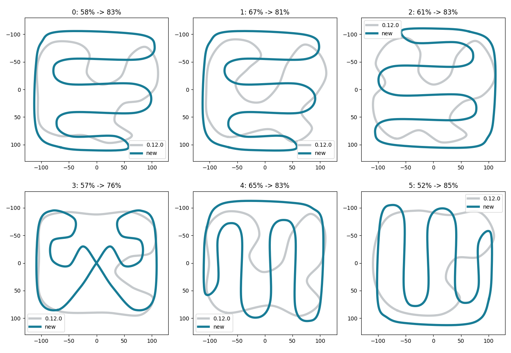
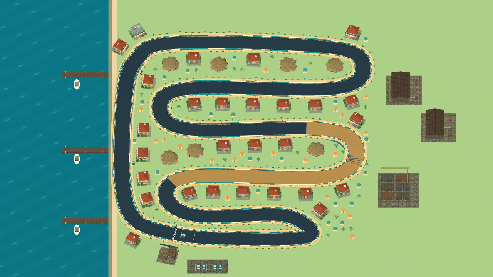
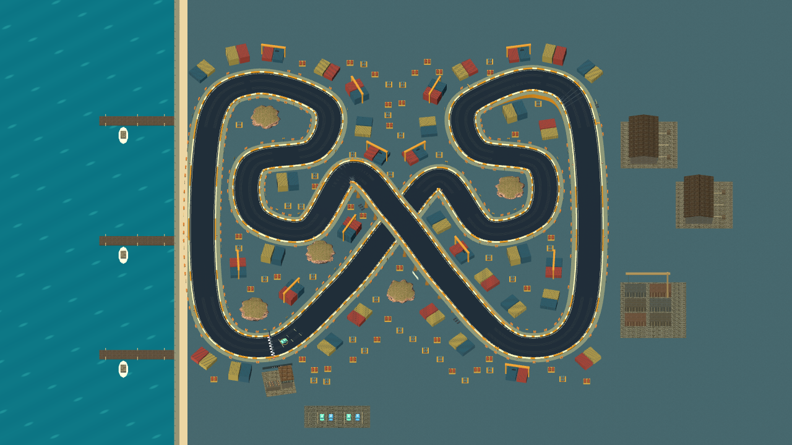
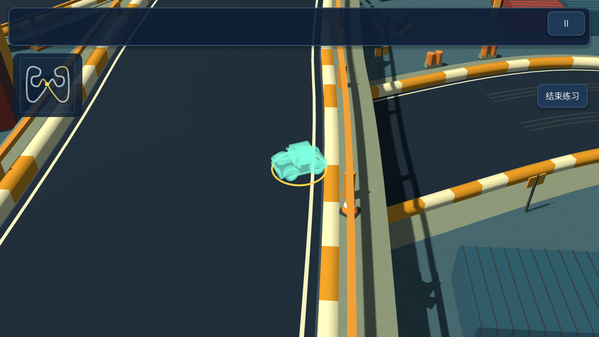

# 0.13.0 地图利用率更新

六张地图从外围绕行改为更多内部回环和折返。普通地图通过多排连续弯道使用中部空间，货港采用双回环与中央 9 米高的立体交叉。道路宽度仍为 14 米，单圈长度增加到约 1.19–1.33 公里。

## 同一范围内的道路覆盖

测量口径：在固定的中央 220×220 米范围内，每隔 5 米取一点，统计距离道路中心线不超过 20 米的采样点占比。该指标衡量道路及邻近景观的分布，不等于沥青铺装面积，也不是整个远景地形的占地率。

| 地图 | 0.12.0 | 0.13.0 | 单圈长度 |
| --- | --- | --- | --- |
| 海湾 | 57.7% | 83.3% | 1328 米 |
| 松林 | 66.6% | 81.0% | 1271 米 |
| 红岩 | 61.3% | 83.3% | 1328 米 |
| 货港 | 57.4% | 75.6% | 1192 米 |
| 集市 | 65.1% | 83.3% | 1328 米 |
| 雪岭 | 51.6% | 85.1% | 1314 米 |

原始控制点与测量结果见 [布局数据](layout-density-data.json)。`tests/layout_density.gd` 使用独立的十米采样网格做覆盖率回归，并检查非相邻道路间距及高度差，防止通过重叠道路提高指标。

## 驾驶与存档

桥梁与冲高坡重新匹配新路线。货港桥上、桥下路线在同一位置交叉，路线提示和检查点按各自高度区分。桥墩生成避让下层行车区域。计时赛金牌基准相应调整；旧圈速存档保留，新布局使用 `records_compact_v8`，赛事最佳时间使用 `event_times_compact_v8`，车辆、升级、金币、生涯星数保留。

## 验证

192 种地图、方向、车辆与升级组合全部完成一圈，没有离开道路；基础均衡车型的普通 AI 单圈约 59–63 秒。货港上下层路肩通行检查通过。最终画面和 Android 包另作验收，手机帧率尚未验证。

## 新版全景与桥下提示

仓库、停车场等大型景观根据完整占地向外寻找安全位置，避免新道路穿过旧景观。桥下车辆使用仅在受遮挡时显示的透视轮廓；镜头同时预览弯道方向和高度。

最终分项验证及修复后复测通过：布局覆盖/间距、7,292 项高度检查、118 项路肩碰撞、47 项景观布局、1,734 项镜头检查、规则、操控、集成、生涯、产品流程和三场六车比赛。Android 0.13.0 调试包通过签名、ZIP、16 KB 对齐和启动清单校验。
