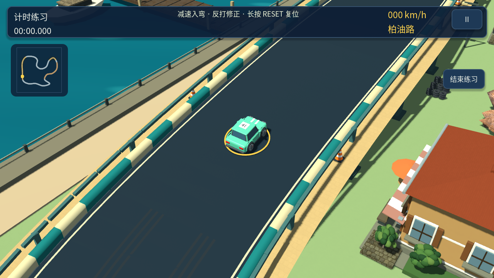
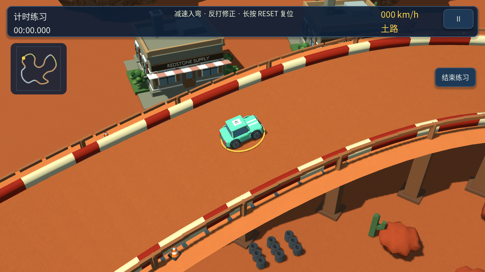
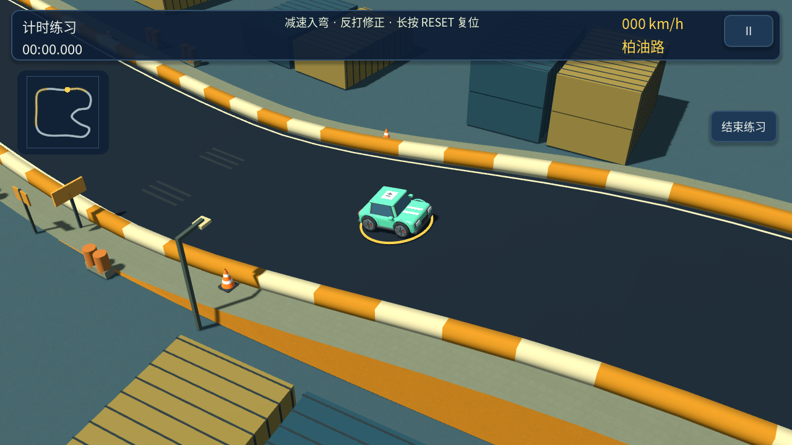
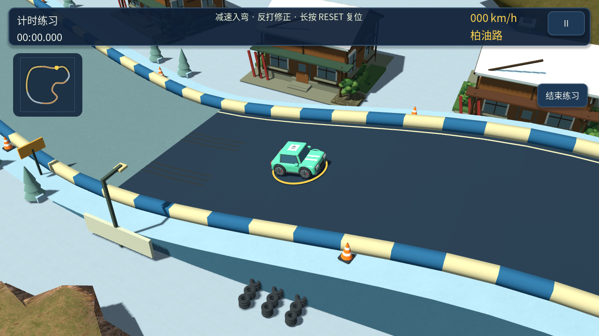

# 0.12.0 桥梁与冲高坡

六张现有赛道各加入一段桥梁和一段冲高坡，共十二处立体路段。保持完整、连续的行车路面，玩家和 AI 都按真实道路高度行驶，车身随行驶方向抬头或俯冲。本版是贴地爬坡与下坡，尚不包含腾空跳跃。

| 赛道 | 桥面高度 | 冲高坡高度 |
| --- | --- | --- |
| 海湾街区 | 5.5 米 | 3.2 米 |
| 松林工坊 | 4.5 米 | 3.8 米 |
| 红岩矿镇 | 7 米 | 4.5 米 |
| 货运码头 | 6.5 米 | 3.5 米 |
| 集市老城 | 4 米 | 3 米 |
| 雪岭营地 | 7 米 | 4.5 米 |

桥梁包含桥面、连续侧梁、护栏和桥墩；冲高坡包含平滑爬升、短坡顶、下坡和侧面挡土结构。入口设有桥梁/坡顶提示。主体结构在低画质下继续显示，沿用有碰撞的道路边界。

高度按正向赛道的世界位置定义，反向行驶经过同一座桥、同一处坡。车辆复位使用实际复位点高度，镜头在行驶中预览前方十八米的高度变化。

计时记录改用 `records_elevation_v7`；旧 `records_district_v6` 平地记录保留在存档中，不再与新路线直接比较。钱包、升级、车辆解锁及生涯进度不清除。

## 验证与复现

`tests/elevations.gd` 检查全部赛道的正反向高度一致性、坡度与高度连续性、坡上车身姿态、复位位置以及旧圈速隔离。`tests/camera_framing.gd` 使用真实道路高度检查车辆和前方路面的构图。现有路肩碰撞与完整比赛测试继续覆盖立体路线。

生成十二个驾驶视角截图：`godot --path . --script tests/capture_elevation.gd -- --all`。输出 `build/elevation-{赛道}-{0桥梁或1冲高坡}.png`。

手机性能、触控手感与最终美术效果仍需真机验收。

## 本版驾驶画面

## 终点通行修复

六车比赛回归发现，已完赛对手停在终点附近可能堵住后续车辆。现在完赛车辆立即关闭碰撞，继续行驶 1.2 秒后退场，保留原完赛成绩和排名。集成测试检查终点通行与成绩保留。

最终验证：高度与正反向一致性 7,292 项、镜头 1,734 项、路肩碰撞 114 项、布局 47 项通过。终点修复后重新运行集成测试（15 项）和三场六车完整比赛，全部通过；规则、操控、生涯、产品流程和路线检查此前已通过。十二张立体路段截图生成成功。

0.12.0 Android 调试包通过签名、ZIP、16 KB 对齐和 Android 清单校验；同时生成待正式签名的发行包。
