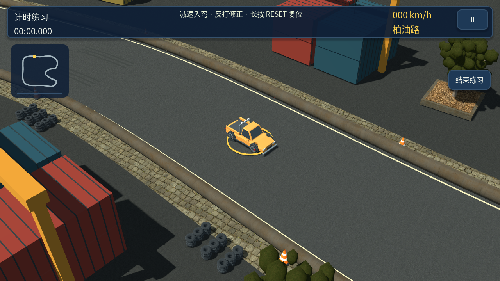
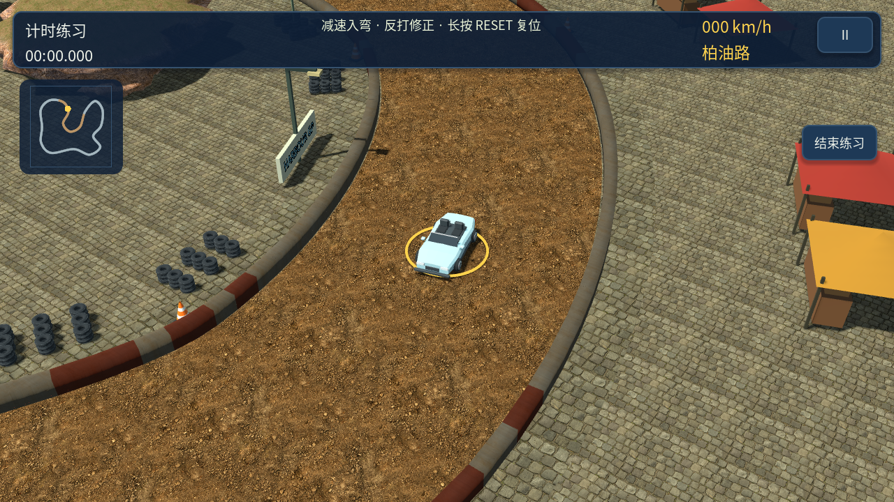
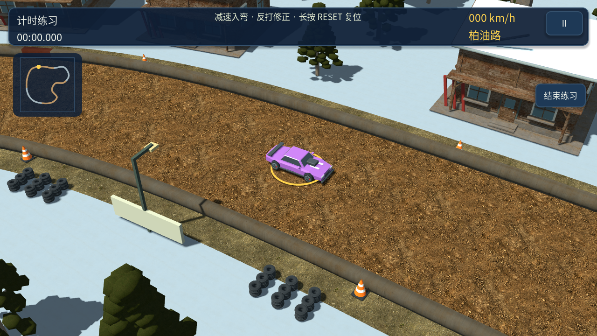
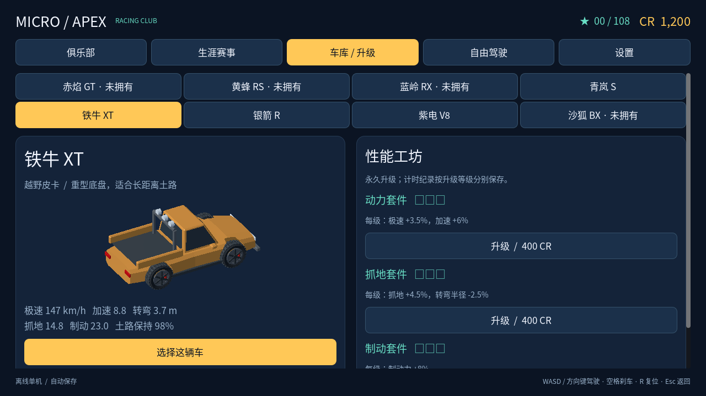
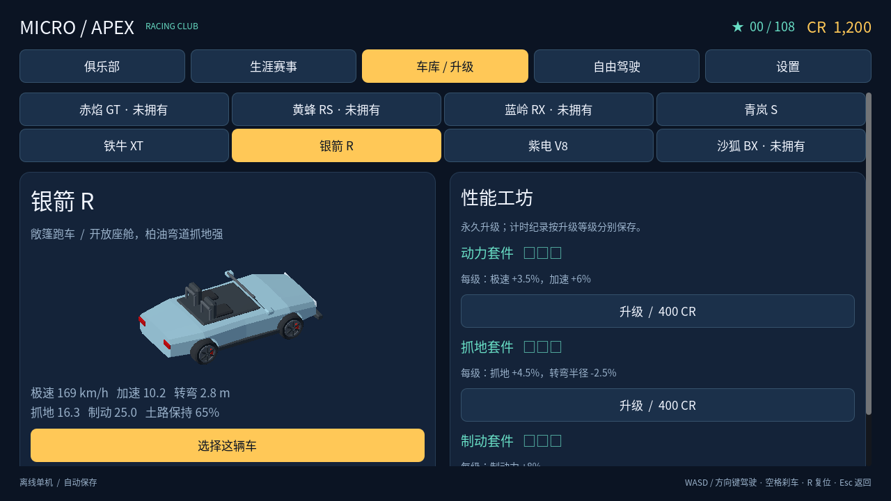
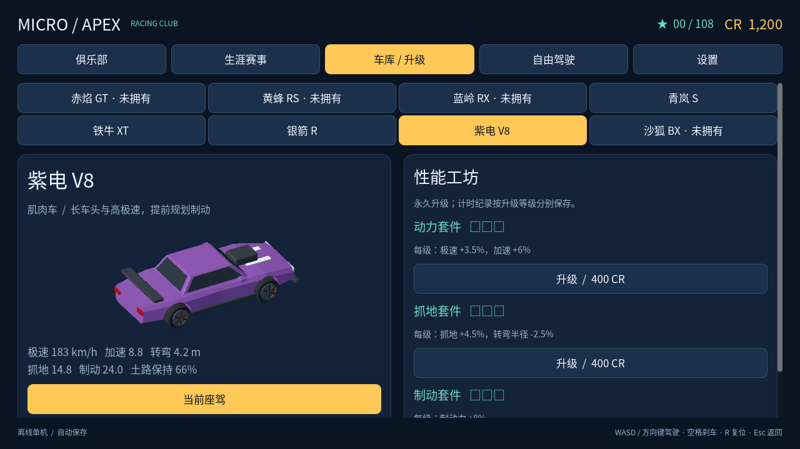
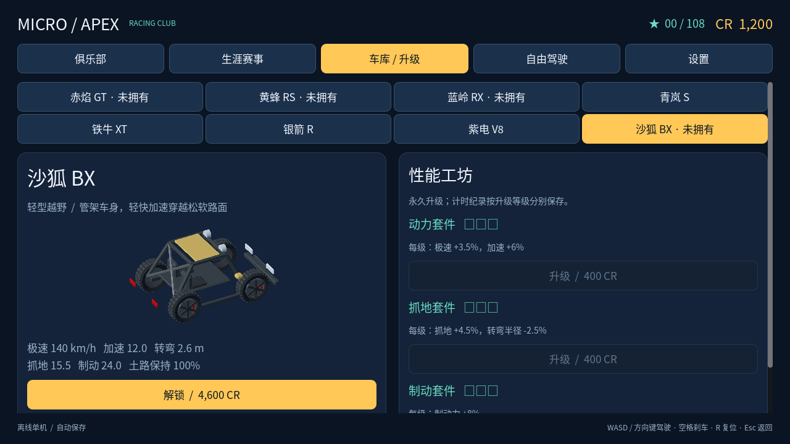

# 0.10.0 地图与车辆扩充

依据 Mini Motor Racing 2 的微缩场景、主题赛道与不同车型轮廓做原创扩充。参考来源沿用[美术对照](art-direction.md)中已核对的 [IGDB 实机场景](https://www.igdb.com/games/mini-motor-racing-2)与 [TapTap 资料](https://www.taptap.io/app/181276)。这里只借鉴内容组织和视觉差异，不宣称新增内容逐一对应原作赛道或车型。

## 地图：3 → 6

| 新地图 | 场景特点 | 驾驶特点 |
| --- | --- | --- |
| 货运码头 | 装卸吊机、货柜堆场、港区铺装 | 纯柏油、长直道与折线回转 |
| 集市老城 | 彩色摊篷、货摊、钟楼广场 | 混合路面、连续紧弯 |
| 雪岭营地 | 雪地、积雪木屋、滑雪架与缆车设施 | 土路拉力、宽弯与长回转 |

三条路线使用新控制点，支持正反两个方向；总计 12 个路线方向。雪岭是积雪环境中的清理道路与土路，不包含独立冰面物理。新环境部分复用原有建筑和植被库。

自由驾驶增加“经典 / 新境”分页，所有新地图可以直接用已拥有的车辆驾驶。

## 车辆：4 → 8

| 新车 | 独立造型 | 操控定位 | 解锁价格 |
| --- | --- | --- | --- |
| 铁牛 XT | 开放货斗、防滚架、辅助灯 | 重型越野皮卡，土路速度保持 98% | 5,200 CR |
| 银箭 R | 敞篷双座、风挡、双防滚环 | 柏油抓地与转弯，土路较弱 | 7,400 CR |
| 紫电 V8 | 长车头、进气罩、尾翼 | 最高极速，转弯半径较大 | 8,200 CR |
| 沙狐 BX | 管架、开放轮胎、轻型车顶 | 轻快加速与土路，极速较低 | 4,600 CR |

四款车均有独立 GLB，复用项目原有轮胎与网格构建函数；动力、抓地、制动升级实际改变车辆参数。可用 `blender -b --python tools/build_expansion_cars.py` 重建模型，可编辑源文件为 `assets/blender/micro_apex_expansion.blend`。

## 生涯与兼容

生涯从 4 杯 24 站扩为 6 杯 36 站，总星数 108。新增“新境巡回赛”和“全域挑战赛”，分别需要 48 / 65 星，覆盖新地图正反方向的竞速与计时。

旧车型、地图、赛事 ID 保持不变，新内容追加。旧金币、车辆解锁、升级、星级与纪录继续使用；经典地图保持原 AI 车型阵容，新地图使用扩充阵容。

## 验证范围

- 规则 52、操控 88、集成 13、路缘碰撞 114、生涯 100、产品流程 19、地图布景 41、镜头取景 1,734 项检查全部通过。
- 192 组自动驾驶组合：6 地图 × 正反向 × 8 车型 × 原厂/满级；全部完赛，无路外采样。这不是多人碰撞或真人平衡结论。
- 新地图各完成一次六车物理实赛，驾驶皮卡、敞篷车和 Buggy；无需在测试中强制传送或跳过检查点。
- 六张新场景截图、四款新车车库截图、地图选择页使用 Godot 实际渲染。
- Android 调试包签名与 16 KB 页对齐验证通过。仍需 Android 实机性能、触控和长期游玩验收。

检查记录见 [扩充验证记录](validation/expansion-0.10.0.json)。
