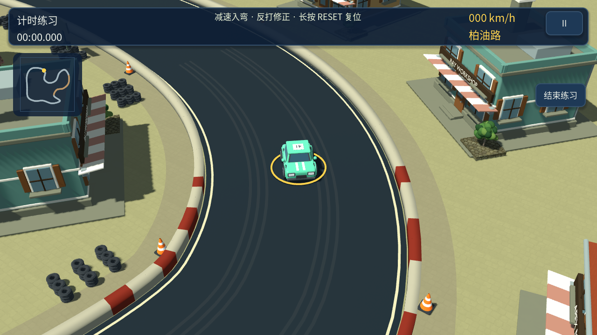
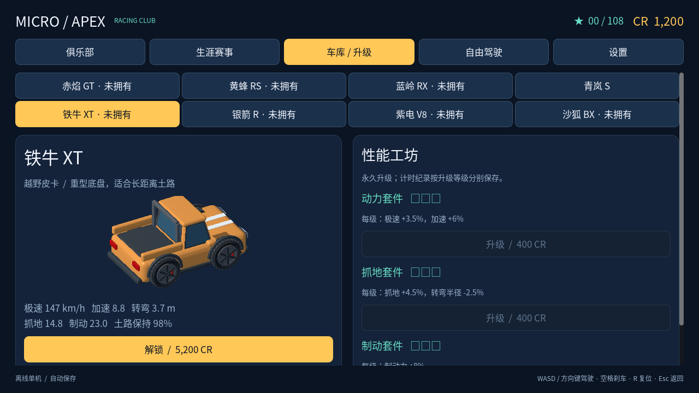
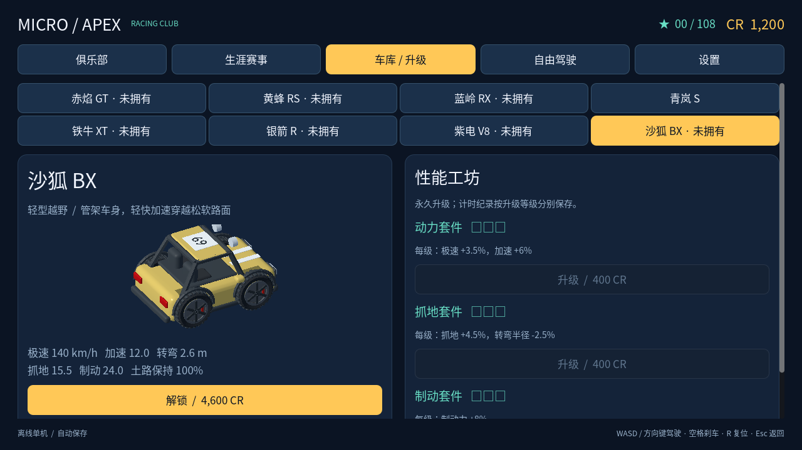

# 0.11.0 微缩赛车美术更新

目标是 Mini Motor Racing 2 所体现的 Q 版拟真方向：夸张比例、清楚轮廓和可信材质。模型为原创，不使用参考游戏资产。此版本供实机美术验收，尚不代表已达到最终商用美术标准。

- 八款赛车全部重建：缩短轴距、加宽车身和座舱、放大车轮，增加圆润轮拱、保险杠与车灯。皮卡、敞篷、肌肉车和越野车保留各自结构。
- 六款建筑缩短、加宽视觉比例并增加倒角，窗户更大；屋顶、墙面与植被使用统一的低对比材质。建筑庭院位于原有预留范围内。
- 赛道、路肩和地表以清楚色块为主，保留轻微真实纹理；树冠改为更饱满的团块。
- 车辆 ID、升级、赛事、路线、操控参数和存档格式保持兼容。

## 重建与验收

当前赛车资源以 `tools/build_miniature_cars.py` 为准；在仓库根目录执行 `blender -b --python tools/build_miniature_cars.py`。编辑源为 `assets/blender/micro_apex_miniature.blend`，输出清单为 `assets/models/miniature-manifest.json`。旧生成器保留作历史参考，运行它们会覆盖对应车型。

建筑和植被使用 `blender -b --python tools/build_district_art.py`。

运行 `godot --path . --script tests/capture_miniature.gd -- --all` 可重现六张地图各两个镜头及八辆车的车库截图，输出至 `build/miniature-*.png`。截图要求可用图形显示环境。

本次使用 Godot 4.7 Compatibility 渲染实机画面；桌面软件渲染不能证明 Android 帧率。仍需在目标手机检查性能、触控和视觉效果。

## 本版画面

## 验证结果

Godot 4.7 导入和十项回归套件通过，包括 1,734 项镜头检查和三场六车比赛；八辆车均保留四个可动画车轮节点。六张地图十二个比赛镜头及八辆车的车库截图生成成功。Android 清单校验六项单元测试通过，0.11.0 调试包通过签名、ZIP、16 KB 对齐和 Provider/启动 Activity 校验。未执行本轮 192 组合平衡测试，操控参数未改；尚未进行 Android 真机验收。
