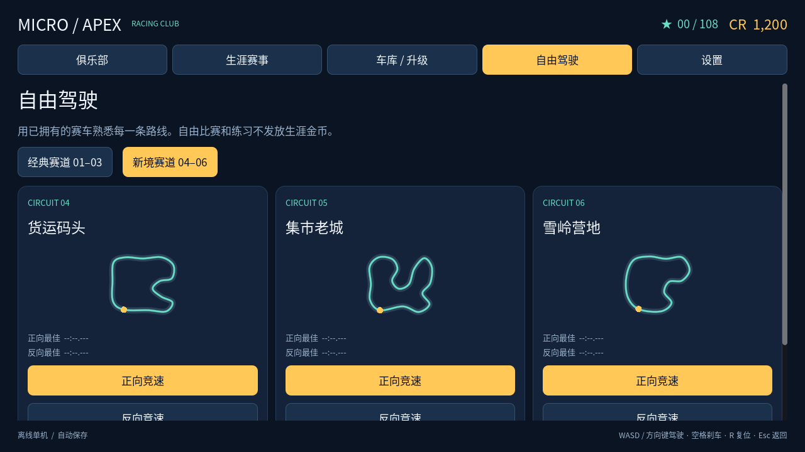

# Micro Apex 0.13.3 — 单机产品候选版

0.13.3 修复倒车及向后侧滑时左右转向反转的问题：左右键始终控制车头向车辆自身左/右转动。保留紧凑地图和立体交叉，详见 [地图利用率更新](compact-layouts.md)。保留 0.10.1 的 Android Gradle 清单修复与校验。

目标是 Android 横屏单机赛车。采用原创 Micro Apex 俱乐部品牌与俯视三维赛车形式。

## 地图与车辆扩充（0.10.0）

现在有 6 张独立地图、12 个行驶方向、8 款赛车，以及 6 杯 36 场生涯赛事。新增货运码头、集市老城、雪岭营地；新增皮卡、敞篷跑车、肌肉车和管架 Buggy。地图有独立中心线与布景，车辆有不同轮廓和性能参数。详情、截图与参考来源见 [内容扩充说明](expansion.md)。

旧地图、车辆和前 24 场赛事的编号不变，新增内容追加在目录末尾；保存的金币、解锁、升级、星级与纪录继续使用。经典赛道保留原 AI 车型配置，新赛道启用扩充车型对手。新地图均可直接在自由驾驶的“新境赛道”分页进入；新杯赛分别需要 48、65 星。



## 完整游玩流程

1. 新玩家获得青岚 S 和 1,200 CR，可进入驾驶训练学习加速、转向、刹车和顺序检查点。
2. 生涯共 6 杯、36 站，覆盖六个环境的正反两个方向，包括六车场地竞速和单车计时挑战。
3. 赢得星级和金币，解锁后续杯赛。冠军 / 前三 / 完赛分别获得 3 / 2 / 1 星；计时挑战按照目标时间评星，使用复位只能获得完赛铜牌。
4. 首次完成赛事额外获得 900 CR；重赛仍有基础奖励，首次奖励不会重复发放。
5. 在车库解锁其他赛车，并为每款车购买动力、抓地、制动各三级升级。参数实际参与驾驶计算；AI 使用公开的同类升级参数，不采用隐藏追赶加成。
6. 结算页提供下一场赛事，全部 36 场完成后显示冠军状态，可继续挑战 108 星。

免费练习和自由比赛使用已拥有的车辆，不发放生涯奖励。单圈纪录按车型、路线方向和升级组合分别保存。

## 可靠性与操作

- 存档使用临时文件校验、重命名替换和上一份有效备份。购买与奖励结算一次提交，失败回滚；一次赛事凭据只允许结算一次。
- 损坏的主档会尝试从备份恢复；两份都不可读时停止覆盖，并在设置页提供明确确认后的备份与新建流程。
- 未完成赛事在重启后提示重新挑战；没有宣称能够恢复比赛中间的车辆位置。
- 支持多点触控、WASD / 方向键、刹车与倒车、长按复位、暂停和系统中断后的倒数恢复。
- 设置包含主音量、音乐音量、画质、自动油门、触控尺寸、镜头距离和自由赛难度。
- 所有界面使用随包字体。音效和循环音乐可由 `tools/build_audio.py` 重建。
- 原生应用不请求 Internet 权限，不包含账号、广告、内购和遥测。

## 构建与验证

引擎固定 Godot 4.7 stable。Android 使用 Java 17+、SDK Platform 36、Build Tools 36.0.0 和匹配的 Godot 导出模板。

```sh
python3 tools/validate.py --godot godot
python3 tools/validate.py --godot godot --balance
GODOT_BIN=godot ANDROID_HOME=/path/to/android-sdk bash tools/build_android.sh
```

在 Godot 编辑器设置中指定 Android SDK 和 Java SDK 路径。`export_presets.cfg` 含 Android 调试、Android 未签名发行和 Linux 导出预设。

- `build/android/micro-apex-0.13.3-review.apk`：ARM64 调试签名安装包，用于设备验收。
- `build/android/micro-apex-0.13.3-release-unsigned.apk`：发行构建，需要发行方使用自己保管的正式证书签名后才能安装或发布。
- `build/android/SHA256SUMS.txt`：构建产物校验。
- `build/linux/`：用于云端验证导出资源与启动的 Linux 版本。

Android 调试签名不能代替长期发行签名；更换证书可能要求卸载旧包，卸载会删除本地进度。不要把正式签名密码或私钥提交到仓库。

## 当前验收证据

详见 [0.10.0 内容扩充说明](expansion.md)。本轮验证包括规则、操控、碰撞、生涯购买与升级持久化、完整比赛流程、地图布景、镜头取景与导出资源；192 组自动驾驶组合均完成一圈，三张新地图另完成六车物理实赛检查。Android 安装包签名已验证，尚未进行 Android 实机性能与触控验收。

历史美术对照保留在 [美术说明](art-direction.md)。自动检查不代表美术质量或真人竞赛平衡已经获得验收。
