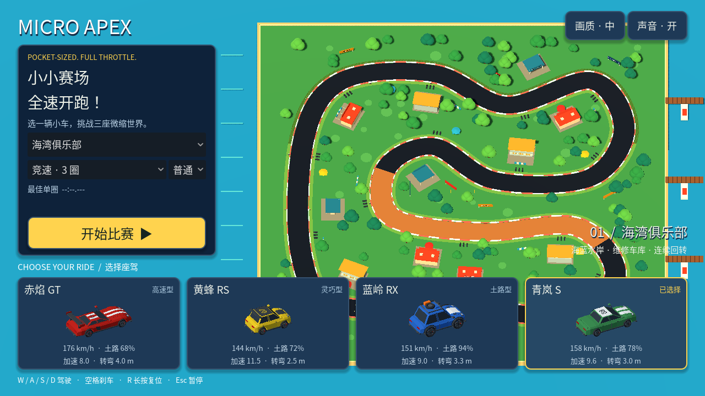
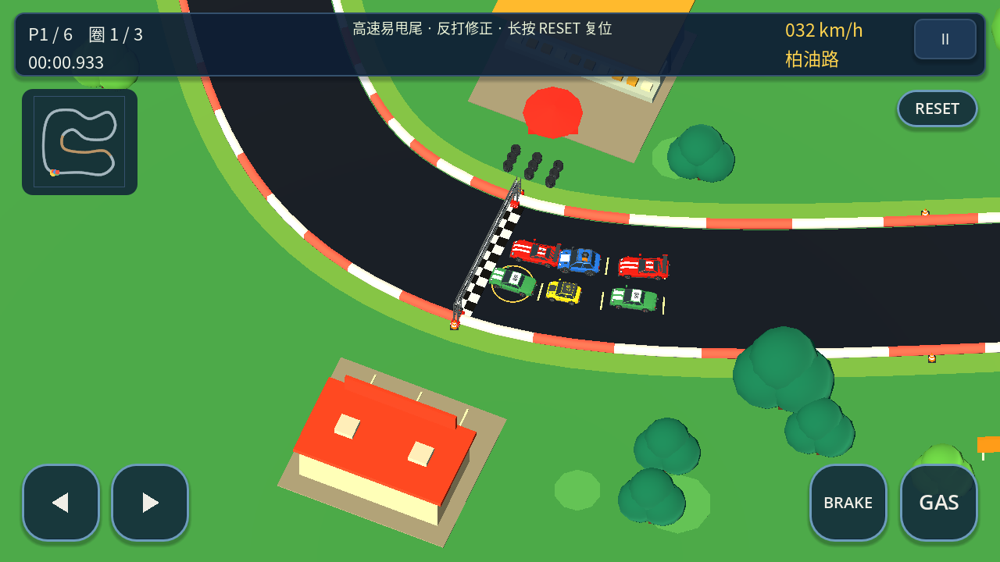

# 微缩赛车俱乐部视觉重设计

> 此页记录早期视觉迭代。当前完整单机流程见 [产品说明](product.md)。

参考 Mini Motor Racing 的微缩模型场景、明快车身配色和固定方向斜俯视镜头，以 Micro Apex 的赛车俱乐部主题重新组织界面与场景。

## 设计落地

- 主菜单：左侧集中选择赛道、模式、难度和开始比赛；右侧实时展示所选赛道；底部四张座驾卡片分别渲染实际 GLB 模型，展示极速、土路保持、加速与低速转弯半径。
- 配色：深蓝界面配亮黄主按钮、选中描边、速度数字和玩家标识。暂停与结算沿用统一样式。
- 微缩世界：海湾、森林、红岩三个主题使用独立环境色；圆润树冠、彩色遮阳伞、观众设施、广告牌、路边护栏和草地斑块丰富赛道周围。
- 比赛视野：正交尺寸 44 → 56，固定俯角约 60°，扩大前方路况与附近车辆可见范围。顶部信息板悬浮，小地图缩小，触控按钮采用圆角与按下反馈；转向图标直接绘制，避免系统字体显示为表情图标。
- 性能：静态选车预览仅渲染一次；新增景物遵守现有低画质隐藏规则。平面路面和路缘关闭投影，消除细碎阴影条纹，建筑和树木保留阴影。

## 实际截图

## 验证

Godot 4.7，Linux，1280 × 720，Compatibility / Mesa 软件渲染。主菜单、比赛、松林和红岩预览均实际渲染检查；云环境截图使用 Dummy 音频驱动。

- 规则 39 项、操控 44 项、场景集成 13 项、路缘碰撞 57 项通过。
- 菜单切换专项检查 14 项通过：四款选车、三个赛道切换、预览视口数量与赛道对应关系。
- 六车试跑：玩家 151.73 秒完成三圈，六车均零复位。

本次集中改造场景、界面与镜头。现有赛道路线、车辆动力参数和比赛规则继续使用。软件渲染截图不代表 Android 帧率；手机上的触控、音频和性能仍需实机验证。
