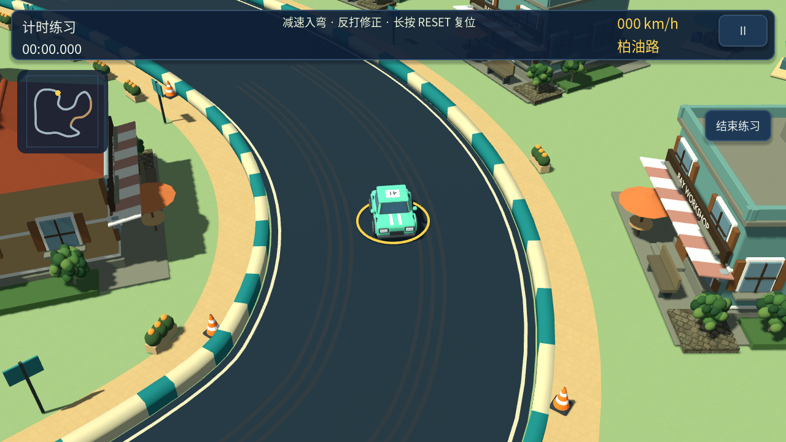
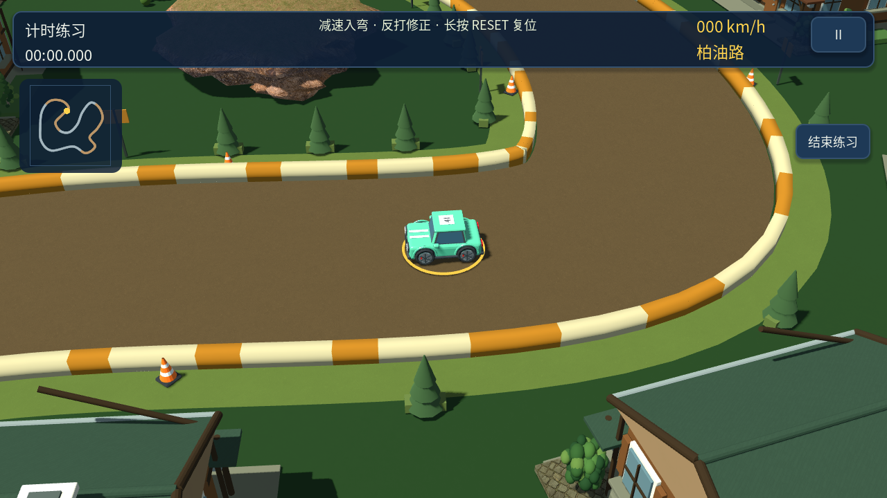
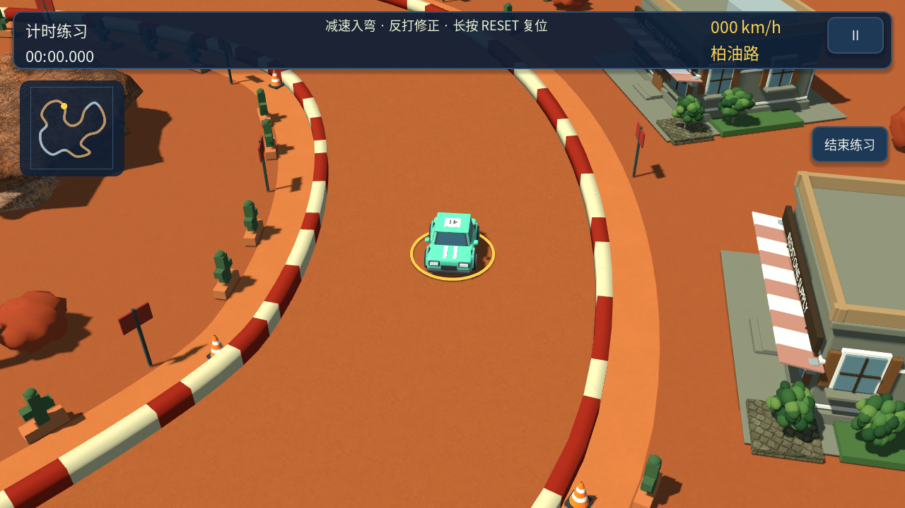
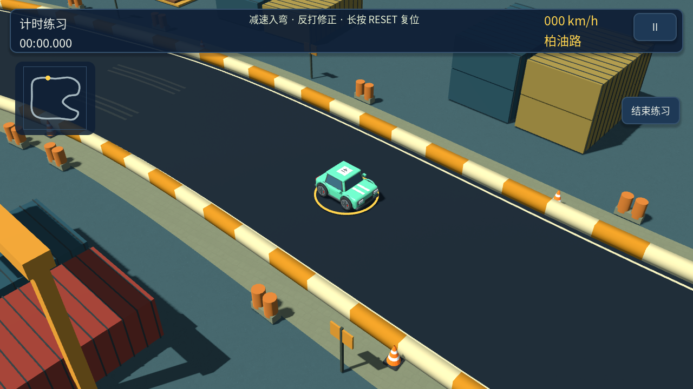
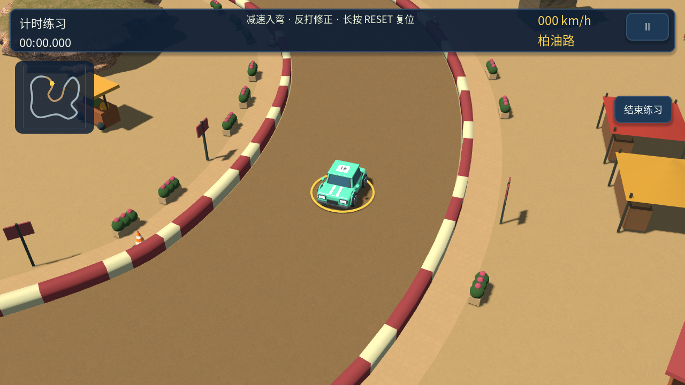
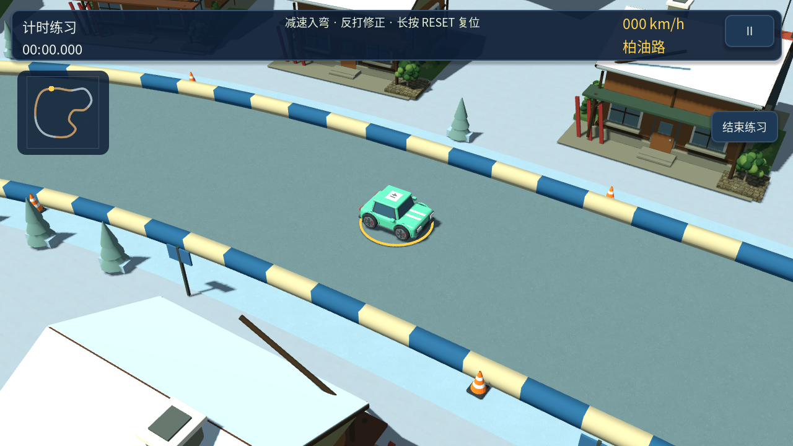

# 0.11.1 赛道景观与主题

解决大建筑之间缺少中小景物、路边长距离留白和赛道共用配色的问题。保留现有行车路线与宽度，通过沿路景物和填充建筑间空地增加视觉密度。

| 赛道 | 景观语言 | 路肩配色 |
| --- | --- | --- |
| 海滨 | 棕榈、遮阳伞、露天咖啡座、浅色铺地 | 青绿与奶油白 |
| 林地 | 密集小树丛、灌木、蘑菇 | 土黄与奶油白 |
| 红岩 | 砂岩、仙人掌、暖色地表 | 砖红与奶油白 |
| 货港 | 托盘、油桶、安全色底座 | 工业黄与奶油白 |
| 集市 | 花果推车、彩色棚顶、沿街摊位 | 玫瑰色与奶油白 |
| 雪山 | 雪堆、松林、红色路标 | 冰蓝与奶油白 |

建筑选址采样由 48 处增加到 96 处，仍以占地范围检查道路和邻近建筑。路边新增旗帜、花池和矮灌木；建筑间使用七米网格寻找可容纳的小型主题景观组。所有新增景观先预留占地范围，再建模；高架段不放置地面路边景物。实例化合批和低画质隐藏继续生效。

`track_scenery.gd` 集中管理主题色板与景观组合。`district_layout.gd` 检查每图至少四十组新增景观，并继续检查全部预留范围不侵入道路、不互相重叠。桌面截图不代表手机帧率，需要目标机型验收。

## 验证

六张地图的新增景观组数分别为 278、285、288、287、304、242（包含路边小景和建筑间景观组）。布局验证 47 项通过；玩法回归十套通过，包括 1,734 项镜头检查和三场六车比赛。最终小景调整后再次运行布局检查通过。

## 本版比赛画面

Android 0.11.1 调试包通过签名、ZIP 完整性、16 KB 对齐及启动项/Provider 清单检查，清单验证器六项测试通过。尚未进行手机真机性能验收。
